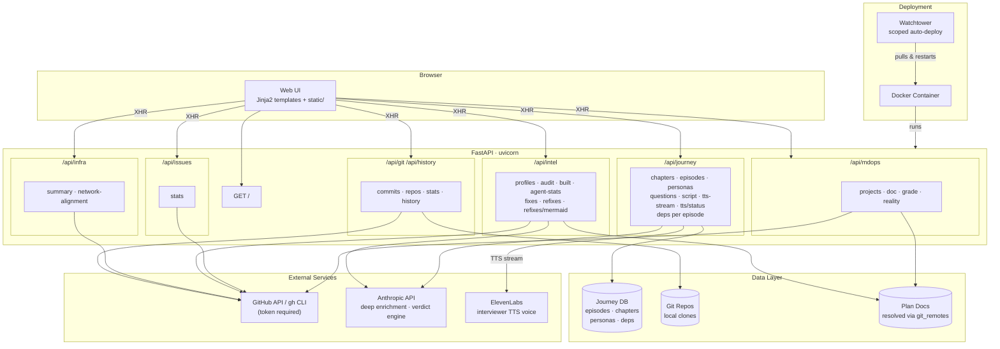

# homelab-status — proven architecture

> Generated 2026-06-27 via the local claude-lean gateway (claude-fast:sonnet). **Every element is grounded in evidence** — merged PRs (what shipped) + the real code surface (deps/routes). Open issues are shown as gaps, never as working. No README claims, no invented flow.

## Architecture (proven)

## Provenance — the evidence this diagram is built from

**Merged PRs (22)** — what is proven shipped:

- #1: feat: add revenue readiness detection to project profiles
- #2: fix: guard gh CLI token fallback against missing binary
- #3: feat: journey story layer — DB foundation for voice interview series
- #4: feat: Journey tab and /api/journey/* endpoints
- #5: feat: deep enrichment — specific questions from real commit history
- #6: feat: mdops doc lookup via git_remotes — finds plan docs by repo not filename
- #7: feat: journey tab — inline editing, personas, package deps
- #8: fix: journey deep dive unblocked + status toggle to draft
- #9: fix: exclude chapter-placeholder episodes from list + enrich
- #17: fix: run CI on PRs + history-preserving templates (#16)
- #15: docs: what homelab-status is + architecture-understanding map
- #12: feat: ElevenLabs interviewer voice for virtual interview engine
- #21: fix: fail loud on missing GitHub token (#20)
- #24: fix: configure loguru in FastAPI app + cap docker logs (#22)
- #26: refactor: extract frontend from web.py into templates/ + static/ (#25)
- #27: feat: data-freshness stale banner (#23)
- #28: feat: scoped Watchtower auto-deploy + runbook (#19)
- #29: fix: watchtower maintained fork + name-scope (#19)
- #30: docs: capability changelog — what the app can do better now
- #31: feat: re-fix detection — learning verdict engine (#13 Layer A)
- #32: feat: Learnings tab — re-fixes as a Mermaid story (#13 PR 2)
- #33: feat: join plan docs to re-fixes — 'planned area still broke' (#13 PR 3)

**Open issues (4)** — known gaps (NOT drawn as working):

- #10: Pull this in and identify what you are already doing
- #13: EPIC: homelab-status as Source of Truth for the cross-repo learning program (verdict + best-practices scoring)
- #14: EPIC: Architecture Intelligence — one living model of all 4 servers + 200 repos, fed by existing APIs (consume don't recompute)
- #18: chore: add unit tests to PR build gate (no endpoint without a test)

**Real code surface:** 57 API routes, deps from pyproject.toml.
